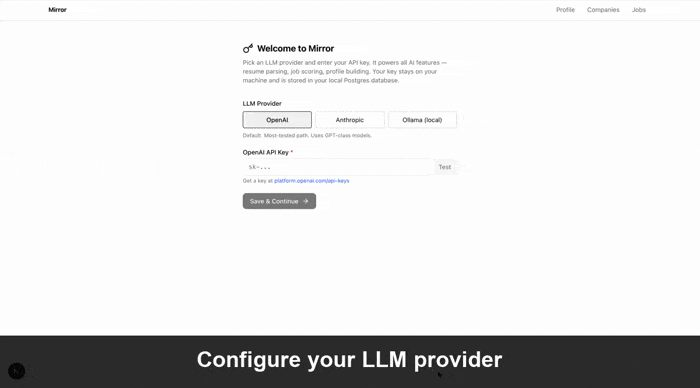
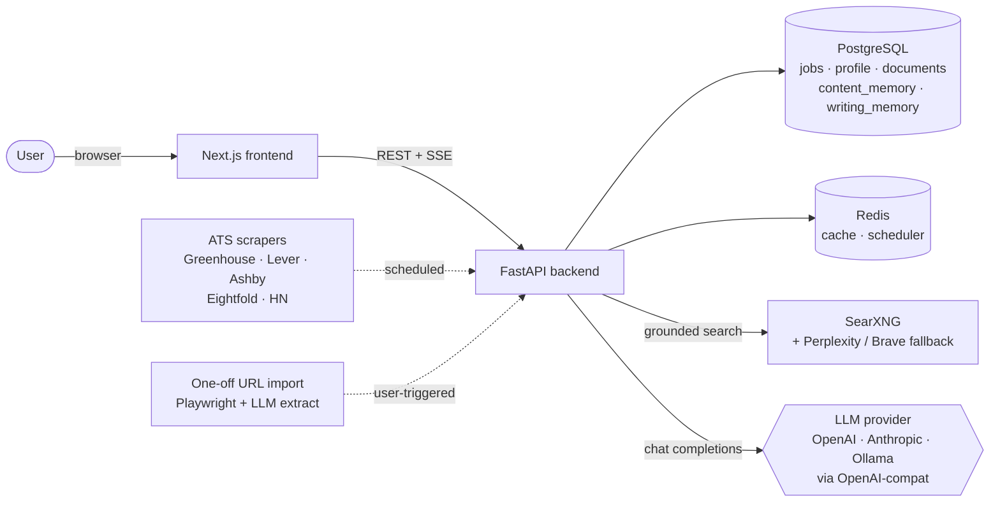

<h1 align="center">Mirror</h1>

<p align="center">
  <em>An AI resume agent that learns your voice from your edits.</em>
</p>

<p align="center">
  <a href="LICENSE"></a>
  <a href="https://github.com/prateekpuri01/mirror/stargazers"></a>
  <a href="https://github.com/prateekpuri01/mirror/issues"></a>
  
  
  
</p>

<p align="center">
  
</p>

Mirror is a self-hosted, local-first job search and resume-tailoring system.
Most AI resume tools generate fresh from scratch every time. Mirror **remembers
the actual phrasings you've hand-tuned** for each accomplishment, employer,
and skill bucket — and feeds them back to the next generation as grounding
examples. After a few rounds of edits, generations sound like *you* writing
about your work, not an LLM imagining how you might.

> ⚠ Status: pre-1.0. The architecture is stable, but expect rough edges in
> the UI and ops surface. Designed for local single-user deployment.

## Why this is different

Three design choices that aren't in the typical "AI resume builder":

### 1. Two-tier memory

- **`content_memory`** stores your final hand-tuned text per entity
  (research description, employer bullet set, skill bucket, summary,
  tagline). Past versions are surfaced as "Past versions ▼" in the editor
  and injected as soft grounding into every future generation. The agent
  inherits your voice on entities you've previously touched.
- **`writing_memory`** stores abstract style rules learned from your edits
  (e.g. "lead with active verbs", "avoid 'leveraged'"). Editable in the
  Profile → Writing Style tab; an LLM-driven Consolidate button distills
  near-duplicates into a tighter set.

Either layer alone is well-trodden ground. Together they cover both
"the right phrasing for *this* accomplishment" and "the user's general
style" without one bleeding into the other.

### 2. Staged generation pipeline

Resumes don't come from a single mega-prompt. The pipeline is:

```
strategic plan → selection → ┬→ research entries (parallel)
                             ├→ skill buckets (parallel)
                             └→ publications (parallel)
                                              ↓
                                              bullets per employer (parallel,
                                              sees finalized research for
                                              cross-section dedup)
                                              ↓
                                              critic (flags voice / overlap /
                                              skills_overlap / passive openings)
                                              ↓
                                              refiner (re-runs ONLY flagged
                                              entities with critic notes)
                                              ↓
                                              summary + tagline (synthesizes
                                              the post-refiner draft)
```

Cross-section deduplication isn't a prompt instruction the LLM may or may not
honor — it's structural. Bullet generation literally receives the finalized
research entries as input. The critic then audits the assembled draft and
the refiner only touches the entities it flags, so memorized phrasings on
clean entities don't get clobbered.

Every leaf call dumps its full system + user + response to
`output/traces/{trace_id}/{stage}.txt` so you can audit what the agent
actually saw at each step.

### 3. Semantic eval in CI

`backend/scripts/eval/eval_focused_edit.py` runs three multi-turn rewrite
scenarios against a real LLM and grades each turn with an LLM-as-judge on:

- **respects_instruction** — did the new value actually do what the user asked?
- **no_fabrication** — are all facts present in the accomplishment data?
- **differs_from_prior** — is the rewrite materially different (proves
  the agent attended to feedback, not just hallucinated agreement)?
- **voice_matches_grounding** — does the new value mirror past versions
  when grounding is shown?

The eval lives in CI (coming) with a pass-rate gate, so prompt regressions
get caught before they ship.

## Quick start

```bash
git clone https://github.com/your-username/mirror.git
cd mirror
./start.sh
```

That's it. `start.sh` verifies Docker is running, checks the five host
ports are free (3050, 8085, 5433, 6379, 8888), builds and starts the
stack, waits for the api migrations to finish and the frontend to be
responding, then opens your browser to `http://localhost:3050`. First
run takes ~3-5 min for image pulls and build; subsequent runs are
seconds.

If you'd rather drive compose directly:

```bash
docker compose up --build -d
open http://localhost:3050   # macOS — Linux: xdg-open
```

No `.env` file to edit, no migrations to run by hand. The api container
auto-runs alembic on boot, the frontend waits for it, and the first
page you land on is `/setup` — pick a provider (OpenAI / Anthropic /
Ollama), paste your API key, and you're in. Keys persist in the local
Postgres `app_settings` table, so they survive container rebuilds
without ever touching a `.env` file.

After `/setup`, the app routes you to `/onboarding`. Upload a resume PDF
or DOCX and the app parses it into a structured profile (optionally
enriched from LinkedIn / Google Scholar / GitHub / your personal site).
Or skip onboarding entirely — the app falls back to the fictional
`docs/profile.yaml.example` profile on first boot if no real one exists,
so you can poke around without giving it your data.

For the **fastest "memory in action" demo**, seed three fictional past
resumes' worth of `content_memory` + a starter set of writing-style
rules:

```bash
docker compose exec api python examples/seed_demo_memory.py
```

This populates the "Past versions ▼" dropdowns and the Writing Style
tab so the grounding/refiner pipeline has something to work with on
your very first generation. See [`examples/README.md`](./examples/README.md)
for what it inserts and how to remove it later.

**Optional**: power users can pre-fill keys via env vars or a `.env`
file (compose auto-loads it). See `.env.example` for the supported
variables. The DB-backed `/setup` flow takes precedence at runtime.

## Stack

- **Backend**: FastAPI (Python 3.12), async SQLAlchemy, Alembic
- **Frontend**: Next.js 16 (App Router) + React + Tailwind + shadcn/ui
- **Database**: PostgreSQL 16
- **Cache/scheduler**: Redis
- **Search**: SearXNG (self-hosted, free) with optional Perplexity / Brave
  fallbacks for grounded company research
- **AI**: Provider-agnostic LLM client — OpenAI (default), Anthropic, or
  Ollama. Set `LLM_PROVIDER=openai|anthropic|ollama` and the matching API
  key in `.env`. OpenAI is the most-tested path; Anthropic and Ollama are
  served via their OpenAI-compatible endpoints, so the same call sites work
  across all three.
- **Scraping**: httpx + Playwright (Chromium)
- **Eval**: pytest + LLM-as-judge

## What's inside

Beyond the memory + pipeline architecture above:

- **Job ingestion** from Greenhouse, Lever, Ashby (including SPA-embed
  pivot), Eightfold, and Hacker News "Who's Hiring" threads. Plus
  one-off URL imports via LLM extraction.
- **Two-axis scoring** — role fit (skills, experience, domain) and
  interest fit (role type, organization signals, practical factors).
  Calibrated by your thumbs up/down feedback.
- **Multi-turn chat editor** with intent-routing (proofread / edit /
  rewrite / question / save preference). The Proofread button is
  deterministic — bypasses the classifier entirely.
- **Past versions UI** — every entity in the editor has a dropdown
  listing its prior hand-tuned versions across all your past resumes.
  Click to swap voice instantly.
- **Disambiguating company research** — uses the job URL's domain as a
  hard anchor when querying Perplexity, so "Surge" doesn't become "the
  SMS API company" instead of the data-labeling lab you actually applied to.
- **Application-question drafting** for short-answer fields on application
  forms.
- **Auto-tagging** with user-defined keyword tags that backfill across
  your whole job pool.

## Architecture



For the full design rationale — what we tried, what didn't work, what
the staged pipeline buys, what the eval proves — read
[**`docs/MEMORY_DESIGN.md`**](./docs/MEMORY_DESIGN.md). It includes
detailed pipeline + memory diagrams and points at every implementation
file.

Quick orientation:
- `backend/app/ai/resume_pipeline.py` — staged generation orchestrator
- `backend/app/services/content_memory_service.py` + `backend/app/ai/writing_memory.py` — memory layers
- `backend/app/ai/resume_agent.py` — LangGraph editing agent
- `backend/scripts/eval/eval_focused_edit.py` — multi-turn semantic eval

## Project structure

```
mirror/
├── backend/
│   ├── app/
│   │   ├── ai/              # Pipeline, prompts, memory, agent
│   │   ├── models/          # SQLAlchemy models
│   │   ├── routers/         # FastAPI routes
│   │   ├── services/        # Business logic, content_memory CRUD
│   │   ├── scrapers/        # ATS scrapers
│   │   └── main.py
│   ├── alembic/             # DB migrations
│   ├── scripts/
│   │   └── eval/            # Semantic eval scenarios
│   └── requirements.txt
├── frontend/
│   └── src/
│       ├── app/             # Next.js App Router pages
│       ├── components/      # React components
│       ├── hooks/           # React Query hooks
│       └── lib/             # API client, types
├── searxng/                 # SearXNG config
├── docs/
│   ├── profile.yaml.example
│   ├── profile_complete.yaml.example
│   └── resume_style.yaml.example
├── docker-compose.yml
└── README.md
```

## Common commands

```bash
docker compose logs -f api               # Tail backend logs
docker compose exec api alembic upgrade head    # Run migrations
docker compose exec api pytest           # Unit tests
docker compose exec api python scripts/eval/eval_focused_edit.py
                                         # Multi-turn rewrite eval
docker compose down                      # Stop
docker compose down -v                   # Stop and wipe Postgres volume
```

## Services

| Service | Container | Host port | Purpose |
|---|---|---|---|
| Frontend | `frontend` | 3050 | Next.js UI |
| Backend API | `api` | 8085 | FastAPI JSON API |
| Database | `db` | 5433 | PostgreSQL 16 |
| Redis | `redis` | 6379 | Cache + scheduler state |
| SearXNG | `searxng` | 8888 | Self-hosted web search |


## Configuration

The `/setup` wizard inside the app handles the only required input —
your LLM provider key (OpenAI / Anthropic / Ollama base URL). Keys
persist to Postgres (the ``app_settings`` table). No `.env` file
required for a normal install.

Power users can pre-fill via env vars or a `.env` (copy from
`.env.example`). Key vars:

- `LLM_PROVIDER` — `openai` (default) / `anthropic` / `ollama`
- `OPENAI_API_KEY` / `ANTHROPIC_API_KEY` — for the matching provider
- `OLLAMA_BASE_URL` — Ollama endpoint when running locally
- `PROFILE_YAML_PATH` — defaults to `/app/docs/profile.yaml` inside the
  container

Web search is provider-native (the LLM's own ``web_search`` tool) with
SearXNG as the always-on local fallback. No separate search-API keys
required — the v0.2 web-search eval showed native LLM search beat
Perplexity on every axis and SearXNG handled every query without Brave
firing. See `backend/scripts/eval/eval_web_search.py` for the data.

For custom resume DOCX styling (fonts, colors, margins), copy
`docs/resume_style.yaml.example` → `docs/resume_style.yaml`. Without that
file, the app uses neutral Calibri defaults.

## Security notes

- **Local single-user.** No auth, no user management, no rate limiting.
  Don't expose ports to the public internet.
- API keys live in `.env` on your host and mount into the API container.
  They never leave your machine except to call the configured providers.
- The crawler honors basic rate limits but doesn't respect robots.txt.

## Contributing

See [CONTRIBUTING.md](./CONTRIBUTING.md) for the dev loop, testing, and
scope guidelines.

## Roadmap

- [x] Pluggable LLM provider (OpenAI + Anthropic + Ollama)
- [x] CI: GitHub Actions running the semantic eval suite on PRs
- [x] Architecture diagram (visual) — see Mermaid diagrams above and in `docs/MEMORY_DESIGN.md`
- [ ] Demo GIF / screencast in this README
- [x] Design doc: [`docs/MEMORY_DESIGN.md`](./docs/MEMORY_DESIGN.md)
- [x] Examples folder with pre-baked content_memory rows: [`examples/`](./examples/)
- [x] Drop NocoDB (was orphaned in the install)

See [`OPEN_SOURCE_RELEASE.md`](./OPEN_SOURCE_RELEASE.md) for the full
pre-release checklist.

## License

MIT — see [LICENSE](./LICENSE).
