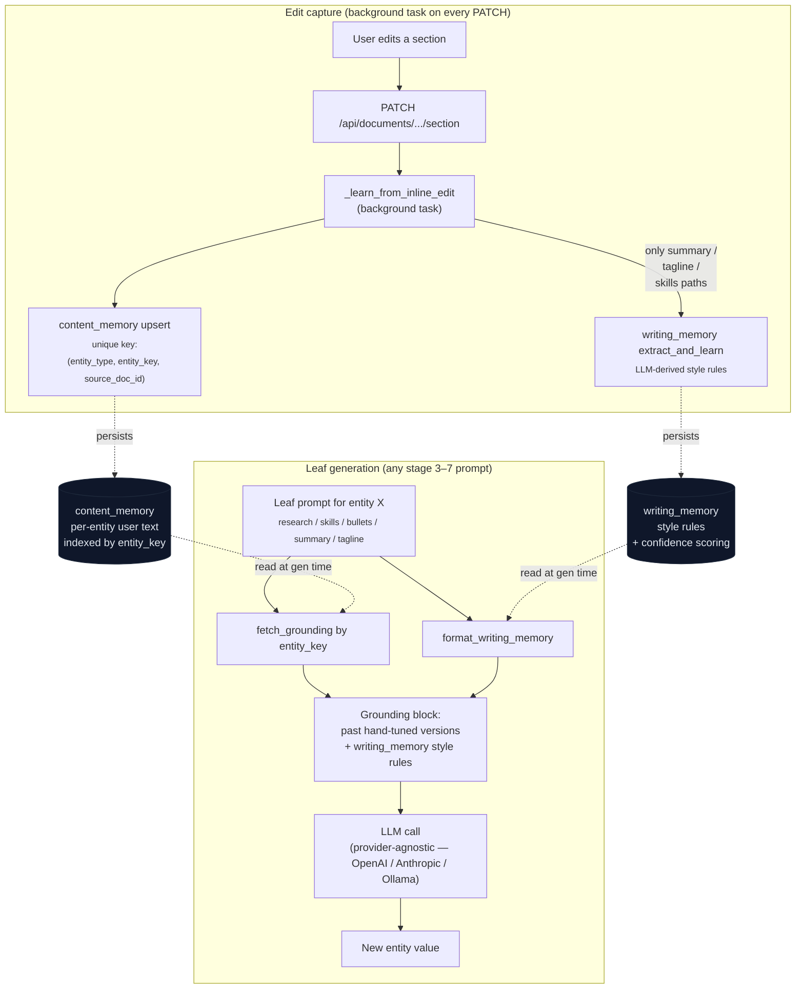
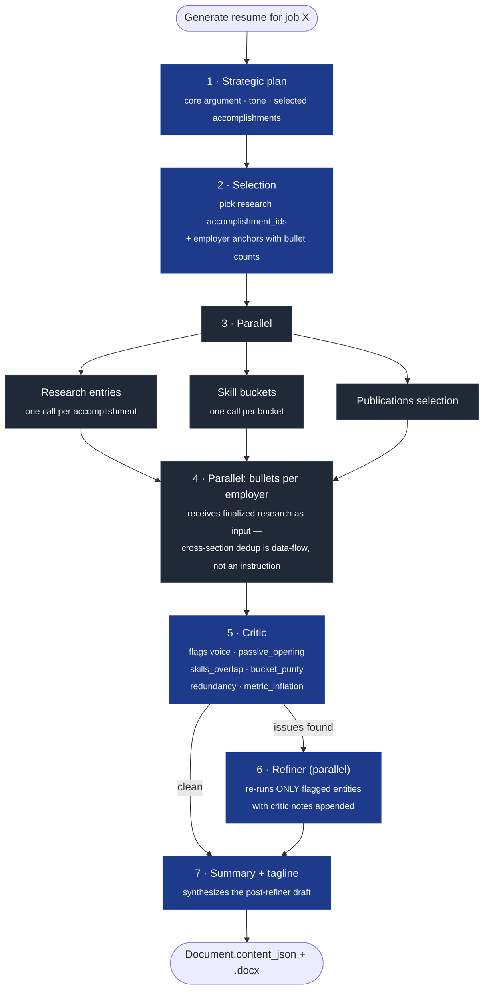

# Memory Design

> How Mirror remembers what the user has hand-tuned, and why a generic
> "AI resume builder" doesn't.

This doc walks through the design of Mirror's memory + generation
architecture. It's written for someone who wants to understand the
*choices*, not just read the code. Where it helps, it points at the
specific files in the repo so you can verify the claim.

## The problem

A user generates a tailored resume. The LLM produces something passable.
The user clicks into a research description and rewrites it: a sharper
opening verb, a metric moved to the end of the sentence, a tightened
second clause. Two weeks later they generate a *different* resume for a
different job and the same accomplishment shows up — phrased awkwardly
again. They rewrite it. Again. And again.

The user's complaint was concrete:

> *"I've fixed the same set of bullet points and selected research snippets
> over and over again. Once a user makes a fix to a language style they
> rarely want to do it all over again."*

This is the design doc for the system that fixed it.

## v3: extraction-based style memory (and why it underfit)

The original architecture was a single-shot generator + a separate
"writing memory" layer that extracted **abstract style rules** from user
edit diffs. The flow:

1. User generates a resume (one big LLM call, full resume in the response).
2. User edits a section. The PATCH endpoint fires a background task.
3. The task feeds `(before, after, section_path, job_context)` to a
   classification LLM that returns rules like
   `{"rule_text": "Use 'built' instead of 'utilized'", "category": "word_choice", ...}`.
4. Rules accumulate in a `writing_memory` table with a confidence score.
   Rules above 0.6 confidence get injected into future generation prompts.

This is implemented in [`backend/app/ai/writing_memory.py`](../backend/app/ai/writing_memory.py).
It's not wrong — it's just incomplete.

### What went wrong

**Style rules need repetition to surface.** The 0.6 confidence threshold
required ~3 reinforcements before a rule fires. A user who corrected
"leveraged" → "used" once and didn't get a chance to do it twice more
saw the rule sit at 0.5 and never appear in prompts. The system felt
forgetful even when it had captured the right signal.

**Style rules are the wrong granularity.** Even when a rule fired
correctly ("avoid passive constructions"), it couldn't capture the
user's preferred *phrasing* of a specific accomplishment. The user's
hand-tuned MUSE description from their Cohere application — concrete,
voice-matched, exactly the phrasing they wanted — was thrown away and
re-generated from scratch every time. The LLM had no way to know that
text existed.

**Single-shot generation papered over redundancy.** The pre-v4 prompt
told the LLM "if an accomplishment appears in both selected_research
and an experience bullet, the bullet MUST say something completely
different." This is an instruction. LLMs follow instructions
inconsistently. Every few generations, the bullet would just paraphrase
the research description for the same accomplishment, and the user
would have to fix it manually.

**The classifier was noisy.** The extraction LLM happily generated
rules from any edit, including one-off content rewrites that weren't
generalizable. We saw rules like "Replace 'qualitative research at RAND'
with 'manual qualitative research workflow'" — that's a content edit, not
a style rule, but the classifier didn't know the difference.

### The mental model that emerged

Two distinct memory needs were collapsing into one layer:

| Layer | Question it answers | Granularity | When it helps |
|---|---|---|---|
| **Style** | "What's the user's general voice?" | Whole-resume | Cold start — no prior version of this entity exists yet |
| **Content** | "What's the user's preferred phrasing for *this* accomplishment / employer / skill bucket?" | Per-entity | Warm — user has touched this entity before |

`writing_memory` only addressed the first. There was no system for the
second — and that's where most of the user's frustration lived.

## v4: two-tier memory + staged generation

### Tier 1: `content_memory` (the new layer)

Stores the user's hand-tuned final text per **entity**, keyed on the
underlying domain object:

| Entity type | `entity_key` | What's stored |
|---|---|---|
| `research_description` | `accomplishment_id` from the profile catalog | The user's prose for that research entry |
| `experience_bullets_set` | `employer_key` (e.g. `rand_corporation`) | The full final array of bullets for that employer |
| `skill_bucket` | `ai_systems` / `data_science` / `engineering` | The user's curated comma-separated list |
| `summary` / `tagline` | `__scalar__` | The user's text |

Schema lives in [`backend/app/models/content_memory.py`](../backend/app/models/content_memory.py).

The unique constraint is `(entity_type, entity_key, source_doc_id)` —
that combination matters. **Within one resume**, every edit on the
same entity overwrites the same row. So a session of three FINRA-bullet
edits collapses to a single final-state record, not three diff records.
**Across resumes**, the same entity (say, `rand-muse` research description)
accumulates a row per resume — which becomes the historical voice
corpus the agent grounds on later.

Edit capture is wired into [`_learn_from_inline_edit`](../backend/app/routers/documents.py)
in the documents router. The PATCH endpoint already fires a background
task on every edit; the task now does two things:

1. Upserts a `content_memory` row for the edit's entity.
2. **Selectively** runs the old style-rule extractor — but only for paths
   under `summary`, `tagline`, and `technical_skills.*`, where abstract
   style is the right granularity. Edits to research and bullets stop
   feeding the rule extractor entirely. Saves cost and stops polluting
   the rule table with one-off content edits.

### Tier 2: `writing_memory` (the old layer, narrowed)

Still extracts abstract style rules. Still gets injected into every
generation prompt. But it's no longer carrying load it shouldn't:

- Triggers only on summary / tagline / skills edits (per above).
- Acts as a **fallback** signal in the leaf prompts. If
  `content_memory` has past versions for an entity, those dominate
  voice; `writing_memory` shapes whatever's left.
- The Profile → Writing Style tab makes the rules editable. A
  Consolidate button calls an LLM-driven distillation pass —
  prompt at [`backend/app/ai/writing_memory.py`](../backend/app/ai/writing_memory.py)
  (`_CONSOLIDATE_SYSTEM`) — that merges near-duplicates and reports
  what got merged into what.

### Capture and retrieval, in one picture



### How they interact at generation time

Every leaf LLM call in the staged pipeline (research entry, skill
bucket, bullet set, summary+tagline) gets a grounding block built from
both layers:

```
## Your past hand-tuned versions for this content
Use these as grounding for tone, phrasing, and emphasis. Do NOT copy
verbatim — adapt to the current job context.

### Most recent (written for: Senior ML Engineer @ Anthropic)
Designed and built MUSE, an internal human-AI research platform...

### Earlier (written for: Lead Data Scientist @ Cohere)
Replaced a manual qualitative research workflow with an AI-assisted system...

### Earlier (written for: MTS @ Cohere)
Designed and developed a platform to replace largely manual...

## Your Writing Preferences (learned from your past edits — ALWAYS apply these)
- Lead bullets with active verbs (Built, Replaced, Shipped)
- Avoid "leveraged" — use "used" or "applied"
- ...
```

The leaf prompt also has a **voice-mirroring directive** that says
explicitly: when grounding examples are present, mirror their opening
verb structure. Without that directive the LLM tries to honor the
"transformation-led" rule by writing things like *"Qualitative research
at RAND moved from a manual workflow to..."* — passive, third-person,
not the user's voice. With the directive, it leads with `Designed`,
`Replaced`, `Shipped` — exactly the openers the user used in past
versions. This is one of the smaller fixes that mattered most.

### Soft grounding, not verbatim cache

The grounding block tells the LLM to **not copy verbatim** — past
versions are stylistic anchors, not text replacements. The user can
adapt content to the new role; the voice stays consistent. There's a
separate "Past versions ▼" UI dropdown in the editor for cases where
the user *does* want to swap exact text from a prior resume.

This split matters. A verbatim cache would clobber legitimate
adaptations (e.g. a different metric matters for a different role).
Soft grounding lets the LLM adapt content while inheriting voice.

## The staged pipeline

Single-shot generation was the other half of the problem. v4 splits it
into a staged pipeline (orchestrator at
[`backend/app/ai/resume_pipeline.py`](../backend/app/ai/resume_pipeline.py)):



Each stage's full system prompt + user message + LLM response is also
dumped to `output/traces/{trace_id}/{stage}.txt` so a regression can be
audited by reading the prompt the agent actually saw.

A few choices worth calling out:

**Stage 4 takes finalized research as input, not just an instruction.**
The single-shot prompt told the LLM "if accomplishment X appears in both
research and a bullet, the bullet must say something different." That's
a soft constraint. In the staged pipeline, the bullet generator
literally receives the finalized research JSON in its prompt and is
told "for any bullet whose accomplishment_id appears above, take a
different angle." The constraint becomes data-flow-driven instead of
LLM-discipline-driven, which means it actually holds.

**Stage 6 is targeted refinement.** Early designs had a critic that
rewrote the whole draft. The problem: the user's hand-tuned phrasings
(now memorized in `content_memory` and used as grounding) would get
silently rewritten by the critic, undoing memory work. Targeted
refinement preserves phrasings the critic doesn't flag.

**Stage 7 (summary/tagline) is last on purpose.** The summary should
synthesize what the rest of the resume actually says. Producing it
first and then writing the body around it (or producing it in parallel
with the body) leads to drift. Producing it last means it can quote
the body's strongest line.

### Per-stage trace logs

Every leaf LLM call dumps its full system + user message + JSON response
to `output/traces/{trace_id}/{stage}.txt`. When a generation comes out
weird, the trace files are the audit trail — you can see exactly what
content_memory grounding was injected, what the critic flagged, what
the refiner saw, what the LLM returned.

This was added late and proved more useful than expected. When a user
reports "this rewrite is strange," the answer is a single `cat` command
on the right trace file.

## The chat agent: focused context

The pipeline is for fresh generation. The user's primary editing surface
is the chat agent — they click on a section, type "make this tighter,"
and a single LLM call rewrites that section. This path lives in
[`backend/app/ai/resume_agent.py`](../backend/app/ai/resume_agent.py)
and was the source of a separate set of failures.

### What was wrong

A focused-edit call was sending ~9–12k tokens, dominated by a full
profile dump (`build_full_profile_for_resume`) on every turn. For a
single-bullet rewrite, that's ~30 accomplishment dossiers and ~40
publications — needle-in-haystack for the model, which would
hallucinate facts from unrelated accomplishments.

The agent also didn't put past content_memory grounding into the focused-
edit path (the staged pipeline did, but the chat path didn't). And the
assistant's chat response after each edit was just `"I updated **path**
based on your instruction."` — the actual rewritten text was never in the
chat record, so on a follow-up turn ("make it tighter") the LLM had no
anchor for "here's what I just produced and here's what you didn't like
about it."

### What changed

Five fixes landed together:

1. **Focused profile slice.** `_focused_profile_for_edit` returns only
   the accomplishment(s) referenced by the section being edited (or the
   strategic plan + featured-list for summary/tagline, or the skills
   whitelist for bucket edits). Saves ~5k tokens per call.
2. **Content memory grounding** in `edit_section`. Same fetch as the
   pipeline, same grounding block format.
3. **Previous-attempts block.** When the user's chat history shows prior
   assistant edits on the same section, render them with the user's
   reaction as paired blocks. The LLM sees "Attempt 1: X. User reaction:
   too wordy. Attempt 2: Y. User reaction: now it lost the metric."
4. **Assistant message contains the actual rewrite.** Format is `Updated
   **{path}** to:\n\n> {new_value}`. The next turn's chat history then
   carries the actual content.
5. **Trim the system prompt** from ~1,200 tokens to ~300. The original
   had voice rules, banned-word lists, and writing quality guidance
   restated three different ways. Consolidated.

Net change: ~6k tokens lighter, more directly relevant content per
remaining token.

## Validation: the eval harness

A multi-turn eval lives at
[`backend/scripts/eval/eval_focused_edit.py`](../backend/scripts/eval/eval_focused_edit.py).
It runs three scenarios that simulate the user clicking a section and
iterating on a rewrite:

1. **Tighten a bullet, then tighten more.** Three turns of progressive
   tightening with specific feedback ("end with the scale figure").
2. **Rewrite a research description with explicit voice feedback.**
   Includes a "lead with 'Replaced'" instruction that exercises the
   voice-mirroring directive against `content_memory` grounding.
3. **Skill bucket dedup.** Tests cross-bucket purity rules with
   feedback like "SQL belongs in data_science, drop it from ai_systems."

Each turn is graded by a separate LLM call with a structured prompt:

- `respects_instruction` — did the rewrite actually do what the user asked?
- `no_fabrication` — are all facts in the new value present in the
  underlying accomplishment data?
- `differs_from_prior` — is the rewrite materially different from the
  prior turn? (Trivial whitespace tweaks count as fail.)
- `voice_matches_grounding` — when past versions are shown, does the
  new value mirror their opening-verb pattern?

Current pass rate: **26 / 27** graded checks across the three scenarios.
The one failure is a real finding the eval is supposed to catch:
on a skill-bucket edit the agent silently added `Claude Code` (not in
the user's whitelist) while doing what was asked. The judge correctly
flagged "no_fabrication: fail." That's the kind of regression that
would otherwise ship invisibly.

The intent is to run this in CI on PRs that touch prompts, the agent,
or the memory plumbing — with a pass-rate gate. Most projects ship
unit tests; almost none ship semantic evals.

## What this is not

Enumerating non-goals because the design above could be over-read:

- **Not a vector memory.** Embeddings would be the natural reach, but
  every entity here has a stable ID (`accomplishment_id`, `employer_key`,
  bucket name). The right key is the domain object, not a similarity
  search.
- **Not a verbatim cache.** Past versions inform voice; they don't
  replace text. The split between soft grounding (in prompts) and
  explicit "Past versions ▼" UI swap (deterministic text replacement)
  matters.
- **Not a fully-deterministic pipeline.** The critic + refiner is
  probabilistic. The eval suite is the safety net, not the type system.
- **Not provider-locked.** The whole stack runs against OpenAI by
  default and against Anthropic / Ollama via their OpenAI-compat
  endpoints (see `backend/app/ai/client.py`).

## Open questions / future work

1. **Bullet-set memory at the bullet level.** Today an entire
   employer's bullet array is one row, keyed on `employer_key`. If the
   user adds one new bullet and leaves others intact, the whole row is
   overwritten. Bullet-level keys (with synthetic stable bullet_ids)
   would let the system retain unchanged bullets across edits — but
   adds schema surface that v1 punted on.
2. **Per-role-family scoping.** A user might want different memorized
   phrasings of the same accomplishment for ML-research vs. applied-AI
   roles. Today all past versions are universal; the LLM just sees the
   `job_context` JSON inline and pattern-matches. A real role-family
   classifier would be sharper.
3. **Stale-content detection.** The system stores `source_text_hash`
   (sha256 of the underlying accomplishment fields at save time) for
   demote-to-soft-reference behavior when the profile changes. The
   demote path works; surfacing the staleness in the UI doesn't yet.
4. **Critic recall.** The critic catches voice / overlap / skills
   issues but isn't tuned on metric inflation as well as it could be.
   More golden examples in the eval would close that gap.
5. **Provider parity.** OpenAI is the most-tested. Anthropic via
   OpenAI-compat works for the chat-completion case but a few callsites
   use OpenAI-only kwargs (`reasoning_effort`) that the other providers
   silently ignore. A clean LLM client wrapper that normalizes these
   would help.

## File map

If you want to read the implementation, here's where each piece lives:

| Concern | File |
|---|---|
| Content memory model + schema | [`backend/app/models/content_memory.py`](../backend/app/models/content_memory.py) |
| Path → entity descriptor parser | [`backend/app/ai/content_memory_paths.py`](../backend/app/ai/content_memory_paths.py) |
| Grounding-block formatter | [`backend/app/ai/content_memory_grounding.py`](../backend/app/ai/content_memory_grounding.py) |
| Content memory CRUD + grounding fetch | [`backend/app/services/content_memory_service.py`](../backend/app/services/content_memory_service.py) |
| Edit capture (PATCH → upsert) | [`backend/app/routers/documents.py`](../backend/app/routers/documents.py) (`_learn_from_inline_edit`) |
| Writing memory model + extractor + consolidator | [`backend/app/ai/writing_memory.py`](../backend/app/ai/writing_memory.py) |
| Writing memory CRUD | [`backend/app/services/writing_memory_service.py`](../backend/app/services/writing_memory_service.py) |
| Staged generation pipeline | [`backend/app/ai/resume_pipeline.py`](../backend/app/ai/resume_pipeline.py) |
| Per-stage prompts | [`backend/app/ai/resume_prompts.py`](../backend/app/ai/resume_prompts.py) |
| Chat editing agent (LangGraph) | [`backend/app/ai/resume_agent.py`](../backend/app/ai/resume_agent.py) |
| LLM provider abstraction | [`backend/app/ai/client.py`](../backend/app/ai/client.py) |
| Multi-turn focused-edit eval | [`backend/scripts/eval/eval_focused_edit.py`](../backend/scripts/eval/eval_focused_edit.py) |
| Past-versions API endpoint | [`backend/app/routers/documents.py`](../backend/app/routers/documents.py) (`get_section_history`) |
| Past-versions UI dropdown | [`frontend/src/components/past-versions-dropdown.tsx`](../frontend/src/components/past-versions-dropdown.tsx) |
| Writing Style management UI | [`frontend/src/components/profile/writing-style-section.tsx`](../frontend/src/components/profile/writing-style-section.tsx) |
